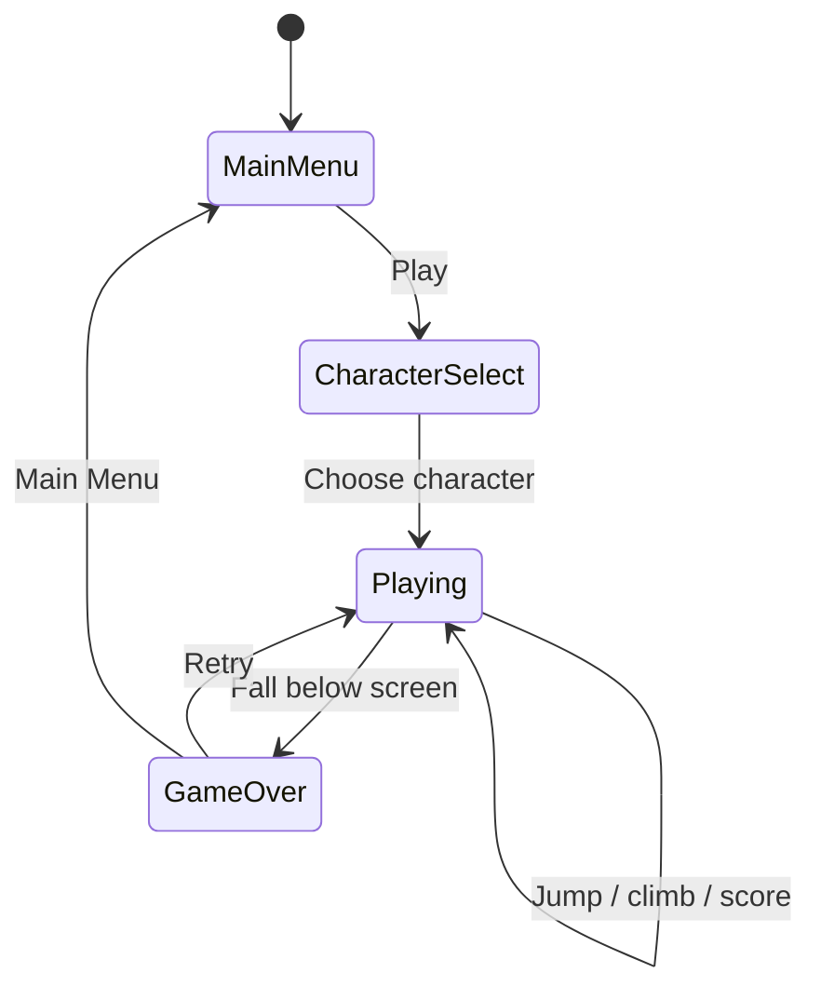
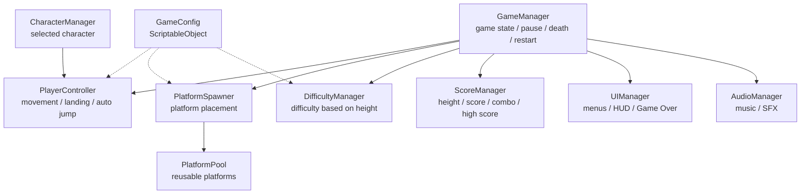

# Game Design Document — *Icy Tower Game*

| | |
|---|---|
| **Working title** | Icy Tower |
| **Team** | Rom Meir , Daniel Freund |
| **Genre** | Arcade / 2D vertical endless platformer / score-chaser |
| **Target platform** | PC (Windows) + Android mobile build |
| **Engine / Unity version** | Unity 6 (6000.3.21f1), 2D |
| **Orientation & reference resolution** | Portrait, 1080 × 1920 reference resolution, 9:16 |
| **Expected session length** | Approximately 30 seconds – 5 minutes per run |
| **Document version** | v0.1 — 2026-09-13 |

---

## 1. High Concept

The player controls one of three selectable characters climbing an endless vertical tower. The character automatically jumps whenever landing on a platform, while the player controls horizontal movement. Platforms become harder and more varied as height increases. Falling below the screen ends the run. The goal is to climb higher, build combos, collect items, and beat the high score.

### Design pillars

1. **Simple controls, skill-based movement** — the player only controls horizontal movement while jumping is automatic. Complicated combat or large control schemes will not be added because they would distract from timing, momentum, and accurate landing.

2. **Always climb higher** — every gameplay system supports the main objective of moving upward and improving the player's score. Features that interrupt the vertical flow for long periods will be avoided.

3. **Short runs with strong replayability** — losing should quickly lead to another attempt. High scores, combos, three selectable characters, special platforms, collectibles, and increasing difficulty encourage repeated runs.

---

## 2. Reference & Inspiration


- **Primary reference:** Icy Tower.
- **Taking:** vertical platform climbing, automatic jumping after landing, horizontal movement, momentum-based jumps, increasing difficulty, height-based scoring, combos, and quick retries.
- **Changing:** three selectable playable characters, mobile touch controls, original visual assets, different platform types, collectibles, optional power-ups, changing backgrounds, and modern mobile UI.
- **Not taking:** original Icy Tower characters, copyrighted artwork, original audio, exact level layouts, or original game assets.
- **Reference image:** the image above is used only as a visual reference for the original Icy Tower gameplay and will not be included as an in-game asset.
- **Video:** a short Icy Tower gameplay reference video will be linked before final submission.

The visual direction will be colorful, readable, and designed for a portrait mobile screen.

The tower environment can visually change as the player climbs higher, for example:

**Tower → City → Clouds → Sky → Space**

---

## 3. Core Game Loop



### Moment-to-moment rules

- The character is affected by gravity.
- After landing correctly on a platform, the character automatically jumps again.
- The player controls horizontal movement to the left and right.
- There is no normal jump button.
- Horizontal speed builds through movement rather than instantly reaching maximum speed.
- Momentum is preserved while the player is airborne.
- Building horizontal speed before landing can therefore allow longer jumps.
- The camera follows the player upward as height increases.
- Platforms that move far below the camera are returned to an Object Pool.
- Pooled platforms are reused above the player instead of constantly being destroyed and recreated.
- New platforms must be positioned so that the next jump is physically possible.
- The beginning of the game mainly contains simple stationary platforms.
- Additional platform types gradually appear as the player climbs.
- Coins or collectibles may appear around platforms and encourage more difficult jumps.
- **Scoring:** the main score increases according to the maximum height reached.
- Bonus score may be earned through collectibles and combos.
- **Combo:** multiple successful jumps performed within a short period increase the combo counter and may provide bonus points.
- **Failure:** if the player falls below the visible gameplay area, the run ends.
- After failure, movement stops, the final score is displayed, and the player can quickly retry.

### Platform types

The game may contain:

1. **Normal Platform**  
   A standard stationary platform.

2. **Moving Platform**  
   Moves horizontally from side to side.

3. **Breakable Platform**  
   Breaks shortly after the player lands on it.

4. **Disappearing Platform**  
   Disappears shortly after activation.

5. **Boost Platform**  
   Gives the player a stronger upward jump.

The MVP does not require every platform type. Additional types are part of the polish stage.

### Parameters you will need to tune

| Parameter | What it controls | First guess |
|---|---|---|
| `moveAcceleration` | How quickly horizontal speed builds | 22 |
| `maxMoveSpeed` | Maximum horizontal movement speed | 7 |
| `airControl` | Amount of horizontal control while airborne | 0.85 |
| `jumpVelocity` | Height of every automatic jump | 11 |
| `gravityScale` | How quickly the player falls after reaching the top of a jump | 2.5 |
| `minPlatformGapY` | Minimum vertical distance between platforms | 1.5 |
| `maxPlatformGapY` | Maximum vertical platform distance | 3.5 |
| `maxPlatformGapX` | Maximum horizontal jump distance | 4 |
| `cameraTriggerHeight` | Position where the camera begins moving upward | 60% of screen height |
| `difficultyRate` | How quickly the game becomes harder | Gradual by height |
| `movingPlatformSpeed` | Speed of moving platforms | 2 |
| `breakDelay` | Time before a breakable platform breaks | 0.4 seconds |
| `comboWindow` | Maximum time between jumps to continue a combo | 2 seconds |
| `collectibleChance` | Probability that a collectible appears | 15% |

**Where these live:** gameplay values will be stored in a `GameConfig` ScriptableObject and/or `[SerializeField]` Inspector fields so that they can be changed during playtesting without rewriting code.

**Feel target:** a first-time player should successfully land several jumps within the first three attempts. After approximately ten minutes of practice, the player should clearly improve at controlling momentum, landing accurately, building combos, and reaching greater heights.

---

## 4. Controls & Input

| Action | Keyboard / Mouse | Gamepad | Touch |
|---|---|---|---|
| Move Left | A / Left Arrow | Left Stick / D-pad Left | Hold left on-screen control |
| Move Right | D / Right Arrow | Left Stick / D-pad Right | Hold right on-screen control |
| Jump | Automatic | Automatic | Automatic |
| Pause | Escape | Start | Pause button |
| Confirm | Enter / Left Click | Main action button | Tap |
| Retry | R / Enter | Main action button | Retry button |
| Main Menu | Escape / UI button | Back button | Main Menu button |

- Horizontal input is read continuously while gameplay is active.
- Jumping is automatic and therefore does not require player input.
- Touching a UI button must not accidentally send movement input to the character.
- Gameplay input is disabled while paused.
- Gameplay input is disabled after Game Over.
- A short delay is used before the Retry button becomes active to prevent accidental restarts.
- Losing application focus automatically pauses the game.
- Keyboard controls are included for development and Unity Editor testing.
- Touch controls are required for the final Android build.

---

## 5. Screens & UI

### 1. Main Menu

Contains:

- Game title
- Play button
- Character Selection button
- High Score display
- Audio / Settings button

### 2. Character Selection

The player chooses between **three playable characters**.

Contains:

- Character 1
- Character 2
- Character 3
- Current selection indication
- Continue button

The selected character is saved and loaded when gameplay begins.

The system will be designed so that additional characters could be added later if required.

### 3. Gameplay

Contains:

- Player
- Platforms
- Background
- Current Score / Height
- Combo indicator
- High Score
- Pause button
- Left touch control
- Right touch control

Example:

```text
+--------------------------------+
| Score: 1250        Best: 3400  |
| Combo x4                Pause   |
|                                |
|             =====              |
|                                |
|        PLAYER                  |
|                                |
|    =====             =====     |
|                                |
|                                |
|   [ LEFT ]        [ RIGHT ]    |
+--------------------------------+
```

### 4. Pause Menu

Contains:

- Resume
- Restart
- Main Menu
- Sound toggle

### 5. Game Over

Displays:

- Final Score
- High Score
- Maximum height
- Best Combo
- Retry button
- Main Menu button

### HUD during play

The HUD will display only information that is useful during gameplay:

- Current score / height
- High Score
- Combo when active
- Pause button
- Mobile movement controls

The game will deliberately not include:

- Health bar
- Inventory
- Minimap
- Quest interface
- Unnecessary menus during gameplay

### Canvas setup

- Screen Space – Overlay
- CanvasScaler: **Scale With Screen Size**
- Reference resolution: **1080 × 1920**
- Portrait orientation
- 9:16 reference aspect ratio
- UI elements will use anchors and safe-area support for different Android devices.

---

## 6. Art & Audio

| Asset | Variants / frames | Source & licence | Use |
|---|---|---|---|
| Playable Character 1 | Idle / jump / fall / land | Original or properly licensed | Playable character |
| Playable Character 2 | Idle / jump / fall / land | Original or properly licensed | Playable character |
| Playable Character 3 | Idle / jump / fall / land | Original or properly licensed | Playable character |
| Normal Platform | 1+ visual variants | Original or properly licensed | Main gameplay |
| Moving Platform | 1+ visual variants | Original or properly licensed | Special platform |
| Breakable Platform | Normal / breaking / broken | Original or properly licensed | Special platform |
| Disappearing Platform | Normal / warning / hidden | Original or properly licensed | Special platform |
| Boost Platform | Idle / active | Original or properly licensed | Special platform |
| Collectible | Idle / collected | Original or properly licensed | Bonus score |
| Background | Tower / city / clouds / sky / space | Original or properly licensed | Height progression |
| UI | Buttons / panels / icons | Original or properly licensed | Menus and HUD |
| Jump SFX | 1–3 variants | Original or properly licensed | Gameplay feedback |
| Landing SFX | 1–3 variants | Original or properly licensed | Gameplay feedback |
| Collectible SFX | 1 | Original or properly licensed | Reward feedback |
| Combo SFX | Several intensity levels | Original or properly licensed | Combo feedback |
| Platform SFX | Break / disappear / boost | Original or properly licensed | Platform feedback |
| Game Over SFX | 1 | Original or properly licensed | Failure feedback |
| Background Music | At least one loop | Original or properly licensed | Gameplay atmosphere |

**Licence note:** no copyrighted artwork, characters, music, sound effects, levels, or other assets from the original Icy Tower game will be included in the final project. The Icy Tower screenshot in the Reference & Inspiration section is used only to show the source of inspiration.

All external assets used in the project will have a recorded source and licence.

Any asset that cannot legally be redistributed will be replaced before a public release.

### Technical art rules

- Consistent Pixels Per Unit settings will be used.
- Android-appropriate texture compression will be used.
- Sprite Atlases may be used where appropriate.
- Characters must remain readable on a mobile screen.

Sorting layers from back to front:

`Background → Platforms → Collectibles → Player → Effects → UI`

---

## 7. Technical Design

### Scenes

The initial project will contain three main scenes:

1. `MainMenu.unity`  
   Main entry point and Main Menu.

2. `CharacterSelection.unity`  
   Selection of one of the three playable characters.

3. `Gameplay.unity`  
   Endless vertical gameplay, Pause, Game Over, and Retry.

Retry will reset the gameplay state without restarting the entire application.

### Packages / systems used

- Unity 2D
- Physics2D
- Unity UI
- Android Build Support
- ScriptableObjects / serialized configuration
- Unity audio
- Coroutines
- Events
- Object Pooling
- Mobile touch input

### Target device

Android smartphone.

The project will use:

**Unity 6 — version 6000.3.21f1**

Final display orientation:

**Portrait**

Reference resolution:

**1080 × 1920**

### Architecture



| Script | Responsibility |
|---|---|
| `GameManager` | Controls Playing, Paused, Game Over, and Restart states |
| `PlayerController` | Reads horizontal input, handles movement, landings, and automatic jumping |
| `PlatformSpawner` | Selects valid platform positions above the player |
| `PlatformPool` | Reuses platform GameObjects instead of destroying them |
| `PlatformBehaviour` | Shared base behaviour for platform objects |
| `MovingPlatform` | Controls moving platforms |
| `BreakablePlatform` | Handles delayed platform breaking |
| `DisappearingPlatform` | Handles timed disappearance |
| `BoostPlatform` | Applies a stronger upward jump |
| `DifficultyManager` | Changes platform spacing and types based on height |
| `ScoreManager` | Handles score, height, combo, and High Score |
| `CharacterManager` | Stores which of the three characters was selected |
| `UIManager` | Controls menus, HUD, Pause, and Game Over UI |
| `AudioManager` | Controls music and sound effects |
| `Collectible` | Handles collectible pickup and bonus score |
| `GameConfig` | Stores editable gameplay tuning values |

### The course features you are implementing

1. **Object Pooling** — platforms are continuously entering and leaving the visible gameplay area because the game is endless. Instead of repeatedly using `Instantiate` and `Destroy`, a collection of platform objects will be reused. Platforms below the camera are returned to the pool and later placed above the player. This reduces unnecessary allocations and suits an endless mobile game.

2. **Coroutines** — time-based gameplay behaviours will use Coroutines. For example, a breakable platform can wait briefly after the player lands before breaking. Disappearing platforms can display a warning and then disappear. Coroutines can also control temporary power-ups, effects, and UI transitions.

3. **Singleton Pattern** — `GameManager` will use the Singleton pattern because only one global game-state controller should exist. It manages Playing, Paused, and Game Over states. `AudioManager` may also use a Singleton if it needs to persist between scenes.

4. **Events** — gameplay events such as score changes, combos, player death, collectibles, and height milestones can notify UI and audio systems without directly coupling those systems to `PlayerController`.

5. **ScriptableObject / Serialized Configuration** — movement, jump strength, platform spacing, difficulty, combo timing, and other values will be exposed outside the gameplay code so they can be adjusted quickly during playtesting.

6. **Mobile Build** — the project will be compiled and tested on Android. Touch controls, portrait UI, safe-area support, performance, and resolution scaling are part of the actual design rather than being added only at the end.

---

## 8. Scope

### 8.1 MVP — the game is not a game without these

- [ ] Working Unity 6 `6000.3.21f1` project
- [ ] Working Android portrait build
- [ ] Main Menu
- [ ] Character Selection screen
- [ ] Three selectable playable characters
- [ ] Gameplay scene
- [ ] Horizontal player movement
- [ ] Automatic jumping after landing
- [ ] Reliable platform collision
- [ ] Vertical camera movement
- [ ] Endless platform generation
- [ ] Object Pooling for platforms
- [ ] Normal platforms
- [ ] At least one special platform type
- [ ] Height-based score
- [ ] Local High Score
- [ ] Gradually increasing difficulty
- [ ] Falling below the screen causes Game Over
- [ ] Game Over screen
- [ ] Retry
- [ ] Pause / Resume
- [ ] Mobile left/right touch controls
- [ ] Basic sound effects
- [ ] At least one real use of a Coroutine
- [ ] Singleton GameManager

### 8.2 Polish — if the MVP is done and playable

- [ ] Moving platforms
- [ ] Breakable platforms
- [ ] Disappearing platforms
- [ ] Boost platforms
- [ ] Combo system
- [ ] Coins / collectibles
- [ ] Simple power-ups
- [ ] Changing backgrounds based on height
- [ ] Character animations
- [ ] Jump and landing effects
- [ ] Combo effects
- [ ] Height milestone effects
- [ ] Better menu transitions
- [ ] Background music
- [ ] Additional platform visual variants

### 8.3 Explicitly out of scope — we are **not** building these

- Multiplayer
- Online multiplayer
- Networking
- Online accounts
- Online leaderboards
- Cloud saves
- In-app purchases
- Advertisements
- Large story mode
- Campaign mode
- Hand-designed traditional levels
- 3D environments
- Open world
- Enemies
- Combat system
- Boss battles
- Character skill trees
- Large inventory system
- Level editor
- Different gameplay abilities for each character
- More than three playable characters for the initial submission
- iOS build for the initial submission

---

## Changelog

| Version | Date | Change |
|---|---|---|
| v0.1 | 2026-09-13 | Initial GDD for an Icy Tower-inspired mobile game |
