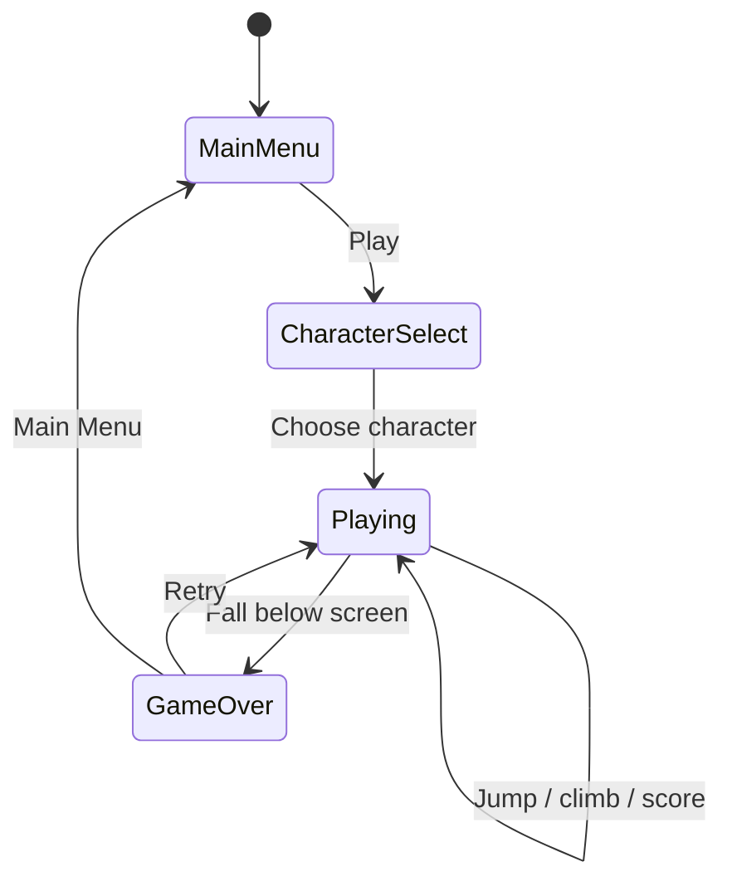
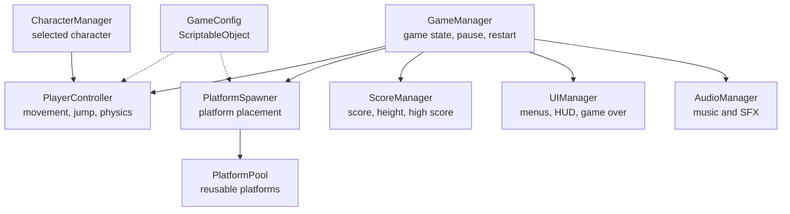

# Game Design Document — *Icy Tower Game*

| | |
|---|---|
| **Working title** | Icy Tower |
| **Team** | Rom Meir , Daniel Freund |
| **Genre** | Arcade / 2D vertical endless platformer / score-chaser |
| **Target platform** | PC (Windows) + Android mobile build |
| **Engine / Unity version** | Unity 6 (6000.3.21f1), 2D |
| **Orientation & reference resolution** | Portrait, 1080 × 1920 reference resolution, 9:16 |
| **Expected session length** | Approximately 30 seconds – 5 minutes per run |
| **Document version** | v0.1 — 2026-09-13 |

---

## 1. High Concept

The player controls one of three selectable characters climbing an endless vertical tower. The player moves left and right and presses Jump to leap between platforms, using horizontal momentum and timing to reach greater heights. The camera scrolls upward as the difficulty increases. Falling below the screen ends the run. The goal is to climb higher, build combos, and beat the high score.

### Design pillars

1. **Momentum and timing-based movement** — success comes from controlling horizontal speed, choosing the right moment to jump, and landing accurately. This rules out complex combat and abilities that replace the core platforming challenge.

2. **Always moving upward** — the entire game is built around continuous vertical progression. Platforms, camera movement, scoring, and difficulty all support climbing higher. This rules out long horizontal sections, exploration areas, or mechanics that stop the upward flow.

3. **Fast retry, high-score mastery** — runs are short, failure is immediate, and restarting takes only a few seconds. The main motivation is improving height, combos, and high score. This rules out long tutorials, story sequences, and complicated progression systems between runs.

---

## 2. Reference & Inspiration

- **Primary reference:** Icy Tower (Free Lunch Design, 2001).  
  **Taking:** vertical tower climbing, automatic jumping after landing, horizontal momentum-based movement, scrolling camera, increasing difficulty, combo rewards, and high-score-focused gameplay.  
  **Not taking:** the original characters, artwork, audio, exact platform layouts, or original game assets.

- **Video:** Icy Tower gameplay reference — focusing on movement momentum, automatic jumping, platform climbing, combos, and increasing difficulty.

The look we are aiming for keeps the simple vertical platforming structure of Icy Tower, but adapts it to a modern portrait mobile game with three selectable original characters, new platform types, collectibles, and changing environments.

---

## 3. Core Game Loop

### Moment-to-moment rules

- The player controls horizontal movement to the left and right.
- The player must press the Jump button to jump from a platform.
- Holding left or right builds horizontal momentum.
- Horizontal momentum affects how far the character travels during a jump.
- The player must combine movement speed, jump timing, and landing position to reach higher platforms.
- The camera scrolls upward as the player climbs higher.
- Platforms below the visible area are recycled and reused above the player.
- As height increases, platform spacing becomes more difficult and special platform types may appear.
- **Scoring:** the score increases according to the maximum height reached. Consecutive successful jumps may increase a combo and award bonus points.
- **Failure:** falling below the bottom of the screen ends the run, stops gameplay, and displays the final score and high score.

### Parameters you will need to tune

| Parameter | What it controls | First guess |
|---|---|---|
| `moveAcceleration` | How quickly the player builds horizontal speed | 22 |
| `maxMoveSpeed` | Maximum horizontal movement speed | 7 |
| `jumpVelocity` | Height of each automatic jump | 11 |
| `gravityScale` | How quickly the player falls after reaching the top of a jump | 2.5 |
| `minPlatformGapY` | Minimum vertical spacing between platforms | 1.5 |
| `maxPlatformGapY` | Maximum vertical spacing between platforms | 3.5 |
| `maxPlatformGapX` | Maximum horizontal distance between reachable platforms | 4 |
| `difficultyRamp` | How quickly platform placement becomes harder as height increases | 5% per height milestone |
| `comboWindow` | Time allowed between successful jumps to maintain a combo | 2.0 sec |

**Where these live:** a `GameConfig` ScriptableObject, allowing movement, jumping, platform spacing, and difficulty values to be balanced without changing code.

**Feel target:** a new player should be able to land several platforms within the first few attempts. After ten minutes of play, the player should clearly improve at controlling momentum, landing accurately, maintaining combos, and reaching a higher score.

---

## 4. Controls & Input

| Action | Keyboard | Gamepad | Touch |
|---|---|---|---|
| Move Left | A / Left Arrow | D-Pad Left / Left Stick Left | Left button |
| Move Right | D / Right Arrow | D-Pad Right / Left Stick Right | Right button |
| Jump | Space | South button | Jump button |
| Pause | Escape | Start | Pause icon |
| Confirm / Select | Enter / Space | South button | Tap |
| Retry | R / Enter | South button | Retry button |

- Horizontal movement input is read continuously while gameplay is active.
- The player jumps only when the Jump input is pressed.
- Holding left or right builds horizontal momentum, which affects the distance of the jump.
- Jump input is accepted only when the character is standing on a platform or during a short allowed jump window.
- A press on a UI button such as Pause or Retry does not also trigger movement or jumping underneath it.
- When the game is paused or the Game Over screen is active, gameplay input is ignored.
- After Game Over, there is a short input lockout before Retry becomes available.
- If the application loses focus, the game pauses automatically.
- Keyboard controls are used for the Windows build, while on-screen touch controls are used for the Android mobile build.

---

## 5. Screens & UI

1. **Main Menu** — game title, PLAY button, CHARACTER SELECT button, High Score display, and a small sound/settings button.

2. **Character Select** — three selectable character options. The currently selected character is highlighted, and a CONFIRM button starts the game with that character.

3. **Gameplay HUD** —
   - Top Left: Current Score / Height.
   - Top Right: High Score.
   - Below the score: Combo indicator, shown only while a combo is active.
   - Top Corner: Pause button.
   - Bottom Left: Move Left button on mobile.
   - Bottom Center: Jump button on mobile.
   - Bottom Right: Move Right button on mobile.

4. **Game Over Screen** — final score, High Score, maximum height reached, best combo, RETRY button, and MAIN MENU button.

5. **Pause Overlay** — RESUME, RESTART, and MAIN MENU.

- **HUD during play:** only score, High Score, active combo, pause, and mobile movement controls are shown. Health bars, minimaps, inventory, and unnecessary information are deliberately absent so the player can focus on the platforms and character movement.

- **Canvas setup:** Screen Space – Overlay, with `CanvasScaler` set to **Scale With Screen Size**, reference resolution **1080 × 1920**, portrait orientation, and responsive anchors for different Android screen sizes.

## 6. Art & Audio

| Asset | Variants / frames | Source & licence | Use |
|---|---|---|---|
| 3 Playable Characters | idle / run / jump / fall | CC0 pack or custom | Playable characters |
| Platforms | normal + special variants | CC0 pack or custom | Gameplay platforms |
| Backgrounds | 3–5 environments | CC0 pack or custom | Visual progression |
| UI Elements | buttons / icons / panels | CC0 pack or custom | Menus and HUD |
| Sound Effects | jump / land / game over / coin | freesound CC0 or custom | Gameplay feedback |
| Music | menu loop + gameplay loop | CC0 / CC-BY | Atmosphere |

**Licence note:** all assets will be original or taken from free-to-use CC0 / CC-BY sources. No original Icy Tower assets will be used.

**Technical art rules:** mobile-friendly 2D sprite assets, portrait layout, and sorting layers ordered as Background → Platforms → Player → UI.

---

## 7. Technical Design

**Scenes:** two scenes. `Menu.unity` contains the Main Menu and Character Select screens. `Game.unity` contains the gameplay, Pause overlay, and Game Over screen. Restart resets the current run without reloading the entire application.

**Packages / systems used:** Unity 2D, Physics2D, Unity UI, ScriptableObjects, Coroutines, Object Pooling, and Android Build Support.

**Target device:** PC (Windows) for development and testing, plus an Android mobile build in portrait orientation.

**Architecture:**

| Script | Responsibility |
|---|---|
| `GameManager` | Singleton that manages Playing, Paused, and Game Over states, restart, and general game flow |
| `PlayerController` | Reads left/right and jump input and controls player movement and physics |
| `PlatformSpawner` | Creates valid platform positions above the player |
| `PlatformPool` | Reuses platform objects instead of constantly creating and destroying them |
| `ScoreManager` | Tracks height, score, combo, and High Score |
| `CharacterManager` | Stores which of the three playable characters was selected |
| `UIManager` | Controls Main Menu, HUD, Pause, and Game Over UI |
| `AudioManager` | Plays gameplay sound effects and background music |
| `GameConfig` | ScriptableObject that stores movement, jump, platform, and difficulty tuning values |

### The course features you are implementing

1. **Singleton** — `GameManager` will be a Singleton because only one global game-state manager should exist. It controls the current game state, pause, Game Over, and restart.

2. **Object Pooling** — platforms are reused through a pool. Platforms that move below the visible screen are returned to the pool and repositioned above the player. This avoids constantly using `Instantiate` and `Destroy` during an endless run.

3. **Coroutines** — Coroutines will be used for time-based actions such as breakable or disappearing platforms, short delays before restarting, and temporary visual or gameplay effects.

4. **ScriptableObject** — `GameConfig` stores values such as movement speed, jump force, platform spacing, and difficulty settings. This allows balancing the game without changing the code.

5. **Mobile Build** — the game will be compiled and tested on Android with portrait orientation and touch controls, while the Windows build will be used for development and testing.
---

## 8. Scope

### 8.1 MVP — the game is not a game without these

- [ ] One playable vertical tower with continuously generated platforms.
- [ ] Player movement left and right, with manual jumping using Space / Jump.
- [ ] A scrolling camera that follows the player upward.
- [ ] Falling below the screen triggers Game Over.
- [ ] Score based on the maximum height reached and a locally saved High Score.
- [ ] Character Select with three playable characters.
- [ ] Main Menu, Gameplay, Pause, and Game Over screens.
- [ ] Object Pooling for reusable platforms.
- [ ] At least one Coroutine used in a real gameplay feature.
- [ ] `GameManager` implemented as a Singleton.
- [ ] PC (Windows) build with keyboard controls.
- [ ] Android mobile build with left, right, and Jump touch controls.

### 8.2 Polish — if the MVP is done and playable

- [ ] Moving, breakable, disappearing, or boost platforms.
- [ ] Combo system for successful consecutive jumps.
- [ ] Coins or other collectibles for bonus points.
- [ ] Changing backgrounds as the player climbs higher.
- [ ] Character jump, landing, and movement animations.
- [ ] Sound effects and background music.
- [ ] Extra visual effects for combos, special platforms, and height milestones.
- [ ] One or two simple power-ups.

### 8.3 Explicitly out of scope — we are **not** building these

- Online or local multiplayer.
- Online leaderboards, accounts, or cloud saves.
- Combat, enemies, or boss fights.
- A story mode or large campaign.
- 3D graphics or 3D environments.
- A level editor or handmade multi-level campaign.
- Complex skill trees, inventory, or character upgrades.
- In-app purchases or advertisements.
- More than three playable characters for the initial version.
- Different gameplay abilities or statistics for each character.
---

## Changelog

| Version | Date | Change |
|---|---|---|
| v0.1 | 2026-09-13 | Initial GDD for an Icy Tower game |
