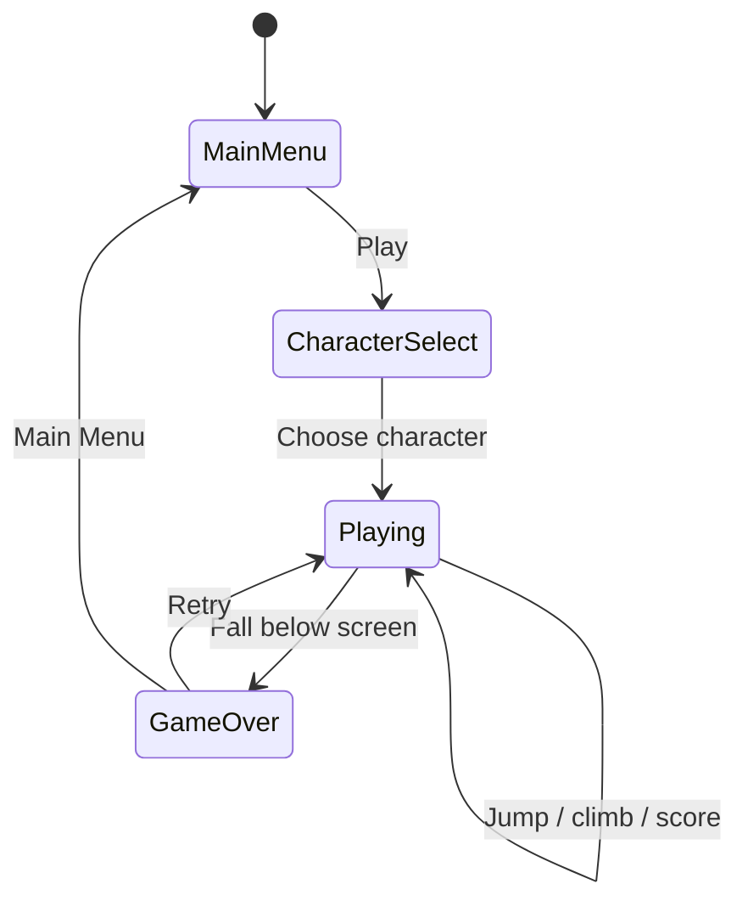
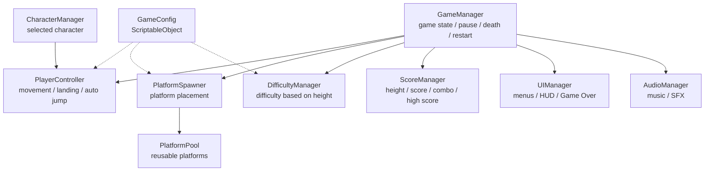

# Game Design Document — *Icy Tower Game*

| | |
|---|---|
| **Working title** | Icy Tower |
| **Team** | Rom Meir , Daniel Freund |
| **Genre** | Arcade / 2D vertical endless platformer / score-chaser |
| **Target platform** | PC (Windows) + Android mobile build |
| **Engine / Unity version** | Unity 6 (6000.3.21f1), 2D |
| **Orientation & reference resolution** | Portrait, 1080 × 1920 reference resolution, 9:16 |
| **Expected session length** | Approximately 30 seconds – 5 minutes per run |
| **Document version** | v0.1 — 2026-09-13 |

---

## 1. High Concept

The player controls one of three selectable characters climbing an endless vertical tower. The player moves left and right and presses Jump to leap between platforms, using horizontal momentum and timing to reach greater heights. The camera scrolls upward as the difficulty increases. Falling below the screen ends the run. The goal is to climb higher, build combos, and beat the high score.

### Design pillars

1. **Momentum and timing-based movement** — success comes from controlling horizontal speed, choosing the right moment to jump, and landing accurately. This rules out complex combat and abilities that replace the core platforming challenge.

2. **Always moving upward** — the entire game is built around continuous vertical progression. Platforms, camera movement, scoring, and difficulty all support climbing higher. This rules out long horizontal sections, exploration areas, or mechanics that stop the upward flow.

3. **Fast retry, high-score mastery** — runs are short, failure is immediate, and restarting takes only a few seconds. The main motivation is improving height, combos, and high score. This rules out long tutorials, story sequences, and complicated progression systems between runs.

---

## 2. Reference & Inspiration

- **Primary reference:** Icy Tower (Free Lunch Design, 2001).  
  **Taking:** vertical tower climbing, automatic jumping after landing, horizontal momentum-based movement, scrolling camera, increasing difficulty, combo rewards, and high-score-focused gameplay.  
  **Not taking:** the original characters, artwork, audio, exact platform layouts, or original game assets.

- **Video:** Icy Tower gameplay reference — focusing on movement momentum, automatic jumping, platform climbing, combos, and increasing difficulty.

The look we are aiming for keeps the simple vertical platforming structure of Icy Tower, but adapts it to a modern portrait mobile game with three selectable original characters, new platform types, collectibles, and changing environments.

---

## 3. Core Game Loop

### Moment-to-moment rules

- The player controls horizontal movement to the left and right.
- The player must press the Jump button to jump from a platform.
- Holding left or right builds horizontal momentum.
- Horizontal momentum affects how far the character travels during a jump.
- The player must combine movement speed, jump timing, and landing position to reach higher platforms.
- The camera scrolls upward as the player climbs higher.
- Platforms below the visible area are recycled and reused above the player.
- As height increases, platform spacing becomes more difficult and special platform types may appear.
- **Scoring:** the score increases according to the maximum height reached. Consecutive successful jumps may increase a combo and award bonus points.
- **Failure:** falling below the bottom of the screen ends the run, stops gameplay, and displays the final score and high score.

### Parameters you will need to tune

| Parameter | What it controls | First guess |
|---|---|---|
| `moveAcceleration` | How quickly the player builds horizontal speed | 22 |
| `maxMoveSpeed` | Maximum horizontal movement speed | 7 |
| `jumpVelocity` | Height of each automatic jump | 11 |
| `gravityScale` | How quickly the player falls after reaching the top of a jump | 2.5 |
| `minPlatformGapY` | Minimum vertical spacing between platforms | 1.5 |
| `maxPlatformGapY` | Maximum vertical spacing between platforms | 3.5 |
| `maxPlatformGapX` | Maximum horizontal distance between reachable platforms | 4 |
| `difficultyRamp` | How quickly platform placement becomes harder as height increases | 5% per height milestone |
| `comboWindow` | Time allowed between successful jumps to maintain a combo | 2.0 sec |

**Where these live:** a `GameConfig` ScriptableObject, allowing movement, jumping, platform spacing, and difficulty values to be balanced without changing code.

**Feel target:** a new player should be able to land several platforms within the first few attempts. After ten minutes of play, the player should clearly improve at controlling momentum, landing accurately, maintaining combos, and reaching a higher score.

---

## 4. Controls & Input

| Action | Keyboard | Gamepad | Touch |
|---|---|---|---|
| Move Left | A / Left Arrow | D-Pad Left / Left Stick Left | Left button |
| Move Right | D / Right Arrow | D-Pad Right / Left Stick Right | Right button |
| Jump | Space | South button | Jump button |
| Pause | Escape | Start | Pause icon |
| Confirm / Select | Enter / Space | South button | Tap |
| Retry | R / Enter | South button | Retry button |

- Horizontal movement input is read continuously while gameplay is active.
- The player jumps only when the Jump input is pressed.
- Holding left or right builds horizontal momentum, which affects the distance of the jump.
- Jump input is accepted only when the character is standing on a platform or during a short allowed jump window.
- A press on a UI button such as Pause or Retry does not also trigger movement or jumping underneath it.
- When the game is paused or the Game Over screen is active, gameplay input is ignored.
- After Game Over, there is a short input lockout before Retry becomes available.
- If the application loses focus, the game pauses automatically.
- Keyboard controls are used for the Windows build, while on-screen touch controls are used for the Android mobile build.

---

## 5. Screens & UI

1. **Main Menu** — game title, PLAY button, CHARACTER SELECT button, High Score display, and a small sound/settings button.

2. **Character Select** — three selectable character options. The currently selected character is highlighted, and a CONFIRM button starts the game with that character.

3. **Gameplay HUD** —
   - Top Left: Current Score / Height.
   - Top Right: High Score.
   - Below the score: Combo indicator, shown only while a combo is active.
   - Top Corner: Pause button.
   - Bottom Left: Move Left button on mobile.
   - Bottom Center: Jump button on mobile.
   - Bottom Right: Move Right button on mobile.

4. **Game Over Screen** — final score, High Score, maximum height reached, best combo, RETRY button, and MAIN MENU button.

5. **Pause Overlay** — RESUME, RESTART, and MAIN MENU.

- **HUD during play:** only score, High Score, active combo, pause, and mobile movement controls are shown. Health bars, minimaps, inventory, and unnecessary information are deliberately absent so the player can focus on the platforms and character movement.

- **Canvas setup:** Screen Space – Overlay, with `CanvasScaler` set to **Scale With Screen Size**, reference resolution **1080 × 1920**, portrait orientation, and responsive anchors for different Android screen sizes.

## 6. Art & Audio

| Asset | Variants / frames | Source & licence | Use |
|---|---|---|---|
| Playable Character 1 | Idle / jump / fall / land | Original or properly licensed | Playable character |
| Playable Character 2 | Idle / jump / fall / land | Original or properly licensed | Playable character |
| Playable Character 3 | Idle / jump / fall / land | Original or properly licensed | Playable character |
| Normal Platform | 1+ visual variants | Original or properly licensed | Main gameplay |
| Moving Platform | 1+ visual variants | Original or properly licensed | Special platform |
| Breakable Platform | Normal / breaking / broken | Original or properly licensed | Special platform |
| Disappearing Platform | Normal / warning / hidden | Original or properly licensed | Special platform |
| Boost Platform | Idle / active | Original or properly licensed | Special platform |
| Collectible | Idle / collected | Original or properly licensed | Bonus score |
| Background | Tower / city / clouds / sky / space | Original or properly licensed | Height progression |
| UI | Buttons / panels / icons | Original or properly licensed | Menus and HUD |
| Jump SFX | 1–3 variants | Original or properly licensed | Gameplay feedback |
| Landing SFX | 1–3 variants | Original or properly licensed | Gameplay feedback |
| Collectible SFX | 1 | Original or properly licensed | Reward feedback |
| Combo SFX | Several intensity levels | Original or properly licensed | Combo feedback |
| Platform SFX | Break / disappear / boost | Original or properly licensed | Platform feedback |
| Game Over SFX | 1 | Original or properly licensed | Failure feedback |
| Background Music | At least one loop | Original or properly licensed | Gameplay atmosphere |

**Licence note:** no copyrighted artwork, characters, music, sound effects, levels, or other assets from the original Icy Tower game will be included in the final project. The Icy Tower screenshot in the Reference & Inspiration section is used only to show the source of inspiration.

All external assets used in the project will have a recorded source and licence.

Any asset that cannot legally be redistributed will be replaced before a public release.

### Technical art rules

- Consistent Pixels Per Unit settings will be used.
- Android-appropriate texture compression will be used.
- Sprite Atlases may be used where appropriate.
- Characters must remain readable on a mobile screen.

Sorting layers from back to front:

`Background → Platforms → Collectibles → Player → Effects → UI`

---

## 7. Technical Design

### Scenes

The initial project will contain three main scenes:

1. `MainMenu.unity`  
   Main entry point and Main Menu.

2. `CharacterSelection.unity`  
   Selection of one of the three playable characters.

3. `Gameplay.unity`  
   Endless vertical gameplay, Pause, Game Over, and Retry.

Retry will reset the gameplay state without restarting the entire application.

### Packages / systems used

- Unity 2D
- Physics2D
- Unity UI
- Android Build Support
- ScriptableObjects / serialized configuration
- Unity audio
- Coroutines
- Events
- Object Pooling
- Mobile touch input

### Target device

Android smartphone.

The project will use:

**Unity 6 — version 6000.3.21f1**

Final display orientation:

**Portrait**

Reference resolution:

**1080 × 1920**

### Architecture

| Script | Responsibility |
|---|---|
| `GameManager` | Controls Playing, Paused, Game Over, and Restart states |
| `PlayerController` | Reads horizontal input, handles movement, landings, and automatic jumping |
| `PlatformSpawner` | Selects valid platform positions above the player |
| `PlatformPool` | Reuses platform GameObjects instead of destroying them |
| `PlatformBehaviour` | Shared base behaviour for platform objects |
| `MovingPlatform` | Controls moving platforms |
| `BreakablePlatform` | Handles delayed platform breaking |
| `DisappearingPlatform` | Handles timed disappearance |
| `BoostPlatform` | Applies a stronger upward jump |
| `DifficultyManager` | Changes platform spacing and types based on height |
| `ScoreManager` | Handles score, height, combo, and High Score |
| `CharacterManager` | Stores which of the three characters was selected |
| `UIManager` | Controls menus, HUD, Pause, and Game Over UI |
| `AudioManager` | Controls music and sound effects |
| `Collectible` | Handles collectible pickup and bonus score |
| `GameConfig` | Stores editable gameplay tuning values |

### The course features you are implementing

1. **Object Pooling** — platforms are continuously entering and leaving the visible gameplay area because the game is endless. Instead of repeatedly using `Instantiate` and `Destroy`, a collection of platform objects will be reused. Platforms below the camera are returned to the pool and later placed above the player. This reduces unnecessary allocations and suits an endless mobile game.

2. **Coroutines** — time-based gameplay behaviours will use Coroutines. For example, a breakable platform can wait briefly after the player lands before breaking. Disappearing platforms can display a warning and then disappear. Coroutines can also control temporary power-ups, effects, and UI transitions.

3. **Singleton Pattern** — `GameManager` will use the Singleton pattern because only one global game-state controller should exist. It manages Playing, Paused, and Game Over states. `AudioManager` may also use a Singleton if it needs to persist between scenes.

4. **Events** — gameplay events such as score changes, combos, player death, collectibles, and height milestones can notify UI and audio systems without directly coupling those systems to `PlayerController`.

5. **ScriptableObject / Serialized Configuration** — movement, jump strength, platform spacing, difficulty, combo timing, and other values will be exposed outside the gameplay code so they can be adjusted quickly during playtesting.

6. **Mobile Build** — the project will be compiled and tested on Android. Touch controls, portrait UI, safe-area support, performance, and resolution scaling are part of the actual design rather than being added only at the end.

---

## 8. Scope

### 8.1 MVP — the game is not a game without these

- [ ] Working Unity 6 `6000.3.21f1` project
- [ ] Working Android portrait build
- [ ] Main Menu
- [ ] Character Selection screen
- [ ] Three selectable playable characters
- [ ] Gameplay scene
- [ ] Horizontal player movement
- [ ] Automatic jumping after landing
- [ ] Reliable platform collision
- [ ] Vertical camera movement
- [ ] Endless platform generation
- [ ] Object Pooling for platforms
- [ ] Normal platforms
- [ ] At least one special platform type
- [ ] Height-based score
- [ ] Local High Score
- [ ] Gradually increasing difficulty
- [ ] Falling below the screen causes Game Over
- [ ] Game Over screen
- [ ] Retry
- [ ] Pause / Resume
- [ ] Mobile left/right touch controls
- [ ] Basic sound effects
- [ ] At least one real use of a Coroutine
- [ ] Singleton GameManager

### 8.2 Polish — if the MVP is done and playable

- [ ] Moving platforms
- [ ] Breakable platforms
- [ ] Disappearing platforms
- [ ] Boost platforms
- [ ] Combo system
- [ ] Coins / collectibles
- [ ] Simple power-ups
- [ ] Changing backgrounds based on height
- [ ] Character animations
- [ ] Jump and landing effects
- [ ] Combo effects
- [ ] Height milestone effects
- [ ] Better menu transitions
- [ ] Background music
- [ ] Additional platform visual variants

### 8.3 Explicitly out of scope — we are **not** building these

- Multiplayer
- Online multiplayer
- Networking
- Online accounts
- Online leaderboards
- Cloud saves
- In-app purchases
- Advertisements
- Large story mode
- Campaign mode
- Hand-designed traditional levels
- 3D environments
- Open world
- Enemies
- Combat system
- Boss battles
- Character skill trees
- Large inventory system
- Level editor
- Different gameplay abilities for each character
- More than three playable characters for the initial submission
- iOS build for the initial submission

---

## Changelog

| Version | Date | Change |
|---|---|---|
| v0.1 | 2026-09-13 | Initial GDD for an Icy Tower-inspired mobile game |
